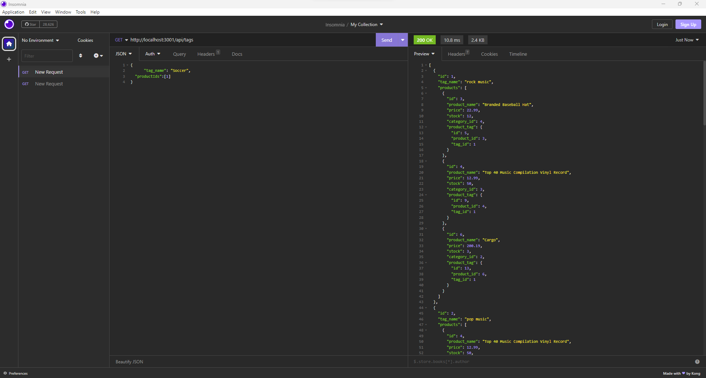

# E-Commerce_Server

## Description

Expanding on my journey of learning I have gotten into sequelize a new way of managing databaeses in mysql. Sequelize lets me make requests to a mysql database in an easier way than the original code needed to get certain data from database. With this new concept of sequelize I been given some code to refactor for an E-Commerce website using sequelize. I will be learning more about sequlize to do certain tasks in my mysql database. tasks such as making tables for the database, making associations between tables, getting data back from the database, updating a certain row from a table with new data, and deleting certain rows from a table. By the end of this project, the E-Commerce I am refactoring, users should be able make requests through their broswer to get, make new data,  update, and delete information from the E-Commerce database. 

## Installation

Now to run this project you will need to install nodejs. I will include the link to get nodejs below. When downloading nodejs just make sure you get the proper version for your device.
 
Nodejs Installation Link: https://nodejs.org/en/download
 
After installing nodejs you will need to install mysql on your own device and make a password for your mysql account. The link below will lead you to the mysql download page.
 
Installation Link: https://dev.mysql.com/downloads/mysql/
 
Then once you have that you will need to install mysql2, express, sequelize and dotenv libraries for this project. I should have the correct libraries already in the package.json file, so all you need to do is enter in the following command in your terminal at the project folder location.
 
    npm install
 
If the previous command does not work you can use these other commands to install the libraries.
 
    npm install mysql2
    
    npm install express
    
    npm install sequelize
    
    npm install dotenv

## Usage

Now the project itself has no pretty user interface. The project just listens to request made through a browser and responds to these requests. The main domain of the E-Commerce database will depend on where you host this project. I will just be using my local device. Another thing to mention is that we have four tables in our E-Commerce database. The tables include Category, Product, Tag, and ProductTag. The request we can send are connected to the different tabels except for ProductTag. I will first go over the post request avaible in the project.

The image above shows a post request which makes a new entry in the category table in the database. This can be repeated for products and tag.

The image above is showing users the post request for products. The only big difference is the body of the put request. Now everything currently in the body of the put request is necessary except for category_id. If we dont have one of the items listed in the body we get an error and we either get a half new made item in proucts or nothing at all. The half made product is made when we do not include tagIds and category_id. Those two parts of the get request will have empty array.

The image above is a post request for tag. Again everthing must be included in the body just as seen through the image or else we get an error.

Next I will go over the put requst and I will just show one image for that. The reason why is because all the put request is the same except for the paths to make the requests and the body. The post request section goes over how the body must be for the put request.

The image above is a put request for products. We know we successfully updated our row if we get a 1 back from the request. Another thing to mention is that we are specifiying which item in the table is updated through the parameters sent in the request. If no item in the table is found through the parameter sent then we through an error and return nothing. The put request paths for the other two tables category and tag are: http://localhost/3001/api/category/:id http://localhost/3001/api/tag/:id.
 

The image above is the error message receveied when we enter in an id that is not found.

The last requests we can do are get request we can get all the data from Category, Product, or Tag tables. If we want to get a single entry from the tables we can specify an id from one of the tables to get that data.Here is how each get request is made: http://localhost/3001/api/products http://localhost/3001/api/category http://localhost/3001/api/tags

The image above is a get request for all the tags in the tag table.
 

The image above is the get request for a single tag from the the tag table.
 
Here is a video demo link: https://drive.google.com/file/d/15BlVsPVwAPIVYIjKwYUoLovlRYY7HXKD/view

## Credits

Thank you to nodejs, sequelize, UC Davis BootCamp and mysql2

Nodejs is the main server running mnd compiling my code

Sequelize to all the documentation on your software.

Link to documentation: https://sequelize.org/docs/v6/category/core-concepts/

Thanks UC Davis for the code on post and put queries in the project. I just reused the code given, but changed it to be async instead of using promises.

thanks to mysql2 for letting me include mysql queries into my javascript without having to go into the mysql shell terminal.

## License

The project is covered by the MIT license. Please refer to the repo for more information on the license. The link below we will link users to the template followed to make license.

License Link: https://spdx.org/licenses/MIT.html

## Badges

## Tests

N/A

## Questions

Any questions you may have you can contact me through my email shown below and there is a link to my github account.

Email: gvv8106@gmail.com

GitHub Profile: https://github.com/Giovanne-Villanueva